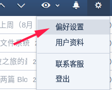
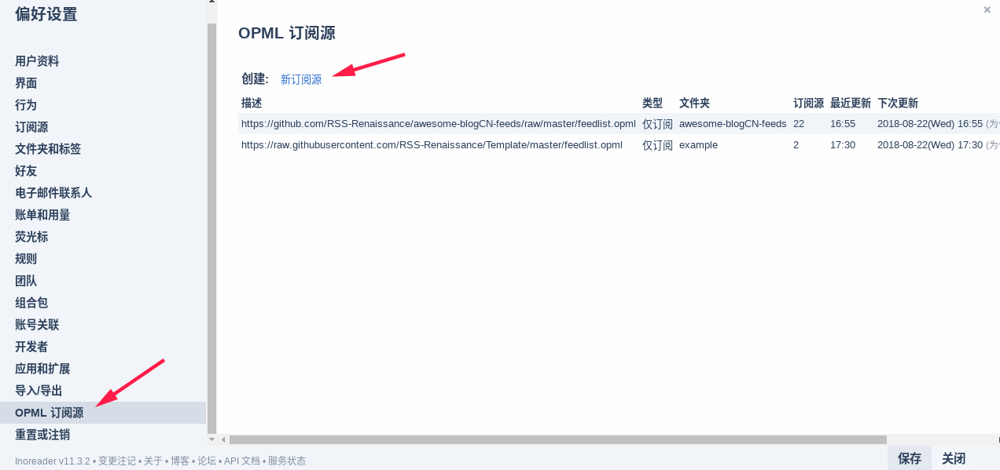
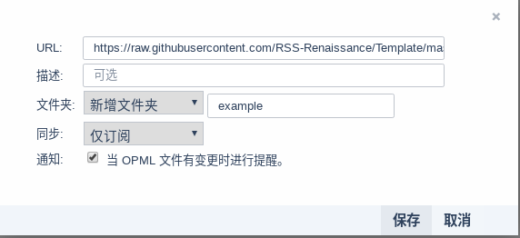
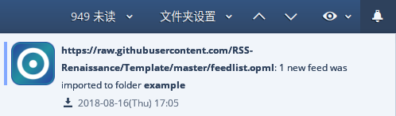

## 1
首先，您需要有一个 [Inoreader](https://www.inoreader.com/) 的账号。

## 2
点击右上角的 **设置** 图标，点击 **偏好设置** 。

## 3

左侧栏选择 **OPML 订阅源** ，点击 **新订阅源** 。

## 4

输入 **OPML 订阅源** 的 URL，建议新增一个文件夹。点保存，订阅成功。

## 5

当这个 **OPML 订阅源** 有更新，即添加了新的 feed ，您将会收到提醒。

